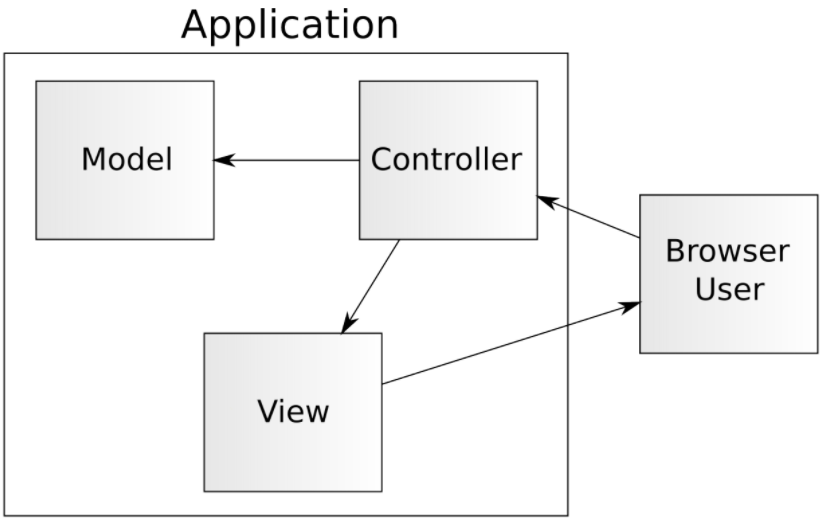

### MVC на диаграмме

Давайте посмотрим на красивую диаграмму MVC. Обычно она выглядит вот так:

Вкратце, контроллер - это секция исходного кода (codebase), которая анализирует запрос и определяет что
сделать. Пользователь запускает контроллер, нажав на определенный URL в своем веб-браузере, который затем
направляет к конкретному контроллеру, предназначенному для обработки этого запроса (немного поговорим о маршрутизации).

Затем контроллер обращается с некоторыми моделями, которые являются представлениями данных. Например, если
мы нажимаем на контроллер, который должен сохранить нового пользователя, контроллер будет заполнять модель пользователя 
User model данными, предоставленными post запросом, а затем сохранит их в базе данных.

Наконец, контроллер возвращает пользователю представление, которое состоит из PHP, HTML, CSS, JavaScript и
изображений. В нашем примере, после создания нового пользователя, мы могли бы перенаправить пользователя на страницу просмотра 
данных по новому пользователю.

  